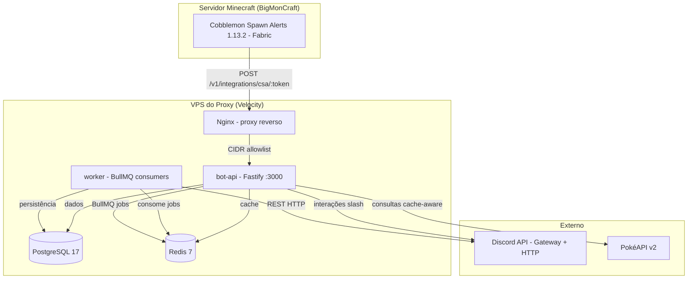
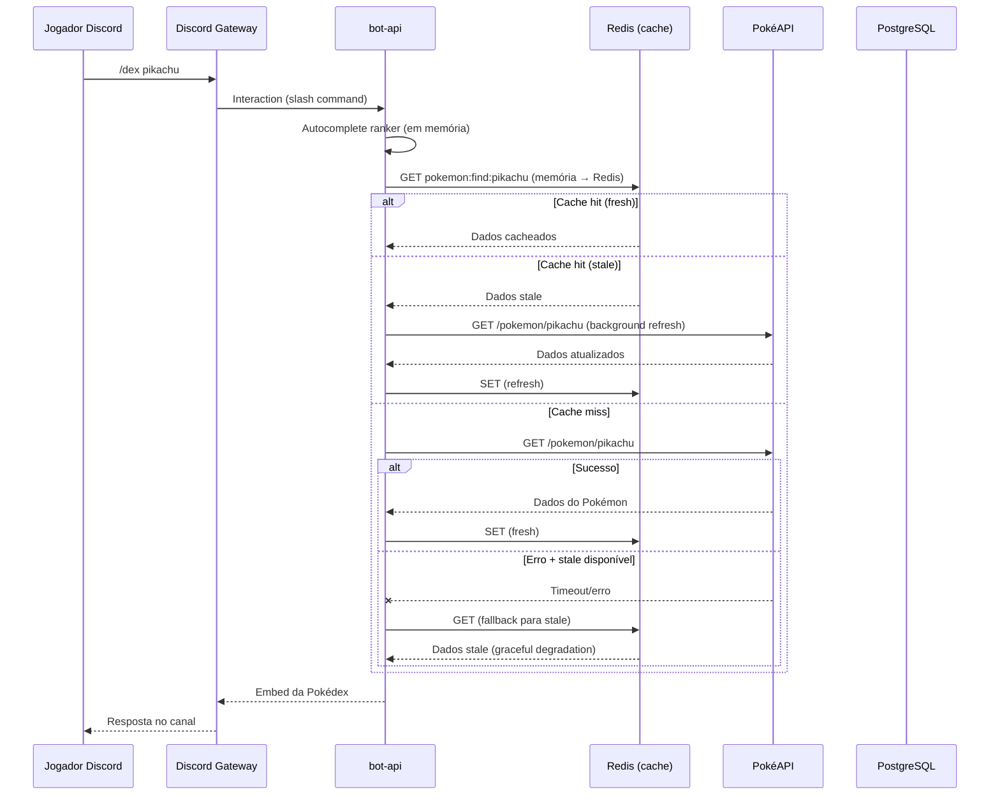
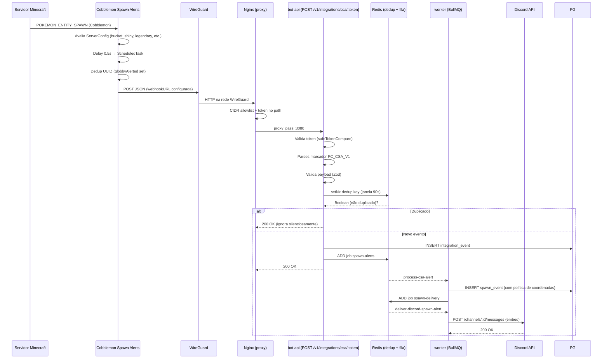
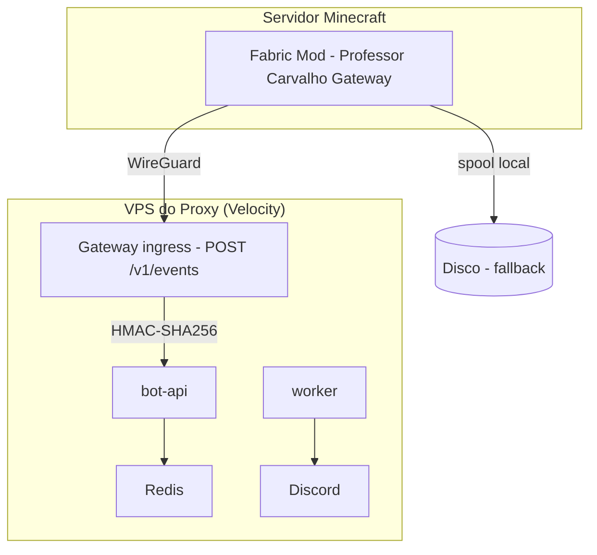
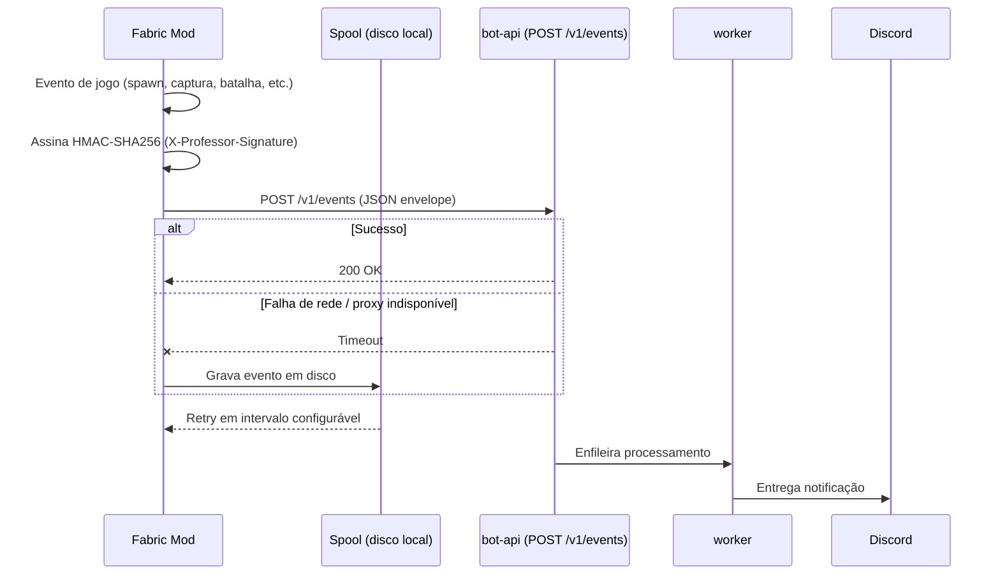

# Arquitetura — Professor Carvalho

## Visão geral

Professor Carvalho é o assistente oficial do servidor **BigMonCraft** (rede BigBangCraft)
no Discord. MVP v0.1.0, stack Node.js 24 + TypeScript, monorepo pnpm com 2 aplicações
e 10 pacotes. Todo o runtime executa no **VPS do proxy Velocity**, não no servidor
Minecraft (vide ADR 0001).



## Serviços

| Serviço           | Tecnologia               | Papel                                                                          |
| ----------------- | ------------------------ | ------------------------------------------------------------------------------ |
| **bot-api**       | Fastify + discord.js     | API HTTP health/metrics/CSA, gateway Discord, comandos slash, autocomplete     |
| **worker**        | BullMQ Workers (3 filas) | Processamento assíncrono de alertas CSA, entrega Discord, limpeza de dados     |
| **PostgreSQL 17** | Drizzle ORM              | Dados de guildas, fontes de integração, eventos, spawns, uso de comandos       |
| **Redis 7**       | ioredis + BullMQ         | Filas de jobs, cache Pokémon (2 níveis), dedup de alertas, heartbeat de worker |
| **Nginx**         | nginx                    | Proxy reverso, CIDR allowlist para o endpoint CSA, limites de corpo/timeout    |

### Pacotes internos

| Pacote                          | Descrição                                                                                                        |
| ------------------------------- | ---------------------------------------------------------------------------------------------------------------- |
| `@bigbangcraft/config`          | Schema Zod de todas as variáveis de ambiente, validação condicional, redação                                     |
| `@bigbangcraft/domain`          | Tipos compartilhados, erros (`ProfessorError`), utilitários (`sha256Hex`, `stableStringify`, `safeTokenCompare`) |
| `@bigbangcraft/database`        | Cliente Drizzle, schema (5 tabelas), repositórios e migrations                                                   |
| `@bigbangcraft/queue`           | Conexão Redis, criação de filas BullMQ, tipos de payload de jobs                                                 |
| `@bigbangcraft/observability`   | Logger pino estruturado, métricas Prometheus, gerenciador de shutdown                                            |
| `@bigbangcraft/pokemon-data`    | Cliente PokéAPI com cache 2 níveis, autocomplete tolerante a erros                                               |
| `@bigbangcraft/cobblemon-data`  | Importador de snapshot de spawns Cobblemon e store em memória                                                    |
| `@bigbangcraft/csa-integration` | Validação de payload CSA, parser de marcador `PC_CSA_V1`, dedup, allowlist CIDR                                  |
| `@bigbangcraft/discord-ui`      | Definições de comandos slash, builders de embed                                                                  |
| `@bigbangcraft/testing`         | Helpers de teste                                                                                                 |

## Fluxo de comandos Discord



## Fluxo de integração CSA



## Fluxo de dados Pokémon

```mermaid
graph TD
    subgraph "Fontes"
        A[PokéAPI v2] -->|JSON schemas| B[PokeApiClient]
        C[Snapshot Cobblemon] -->|JSON importado| D[SnapshotStore]
    end

    subgraph "Cache 2 níveis"
        B -->|fallback| E[InMemoryTtlCache - LRU 512]
        B -->|cache persistente| F[Redis - TTL 24h fresh / 7d stale]
    end

    subgraph "Consumidores"
        E --> G[/dex - Pokédex]
        F --> G
        E --> H[/fraquezas - Type effectiveness]
        F --> H
        D --> I[/spawn - Condições de spawn]
        D --> J[AutocompleteRanker - índice de busca]
        J --> K[Autocomplete interativo]
    end
```

- **Cache L1 (memória)**: LRU com 512 entradas, TTL proporcional ao TTL do Redis / 24
- **Cache L2 (Redis)**: TTL fresh 24h (`POKEMON_CACHE_TTL_SECONDS`), TTL stale 7d (`POKEMON_CACHE_STALE_TTL_SECONDS`)
- **Negative caching**: 404 da PokéAPI é cacheados por 10 min (`POKEMON_NEGATIVE_CACHE_TTL_SECONDS`) em ambos os níveis

## Gateway Fabric (futuro)

O Gateway Fabric é uma funcionalidade planejada para substituir o Modo A (relay CSA)
por um endpoint próprio no servidor Minecraft via mod Fabric. Não está implementado
no MVP (v0.1.0).





### Características do Gateway

- Endpoint: `POST /v1/events`
- Autenticação: HMAC-SHA256 via cabeçalho `X-Professor-Signature`
- Dedup: `X-Professor-Event-Id` (UUIDv7 do lado do servidor)
- Clock-skew: tolerância configurável via `X-Professor-Timestamp`
- Replay protection: armazenamento de nonces em Redis (TTL)
- Spool local no servidor Minecraft: armazena eventos em disco quando o proxy está indisponível
- Sem chamadas HTTP na thread principal do Minecraft: toda comunicação é assíncrona

O contrato detalhado do protocolo está em `docs/future-gateway-contract.md`.
